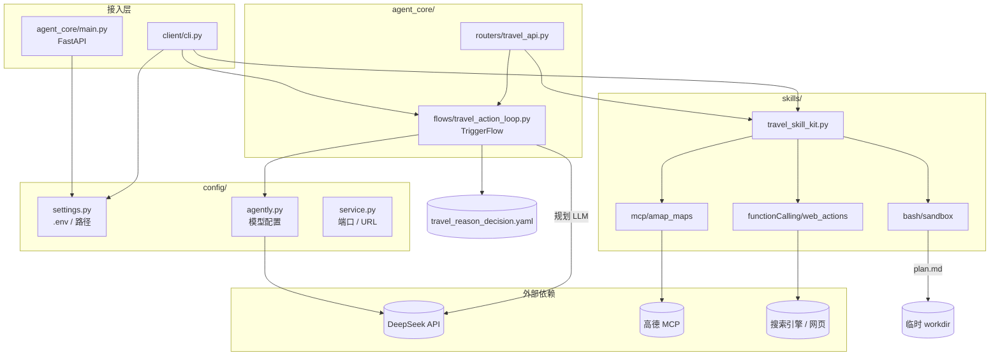
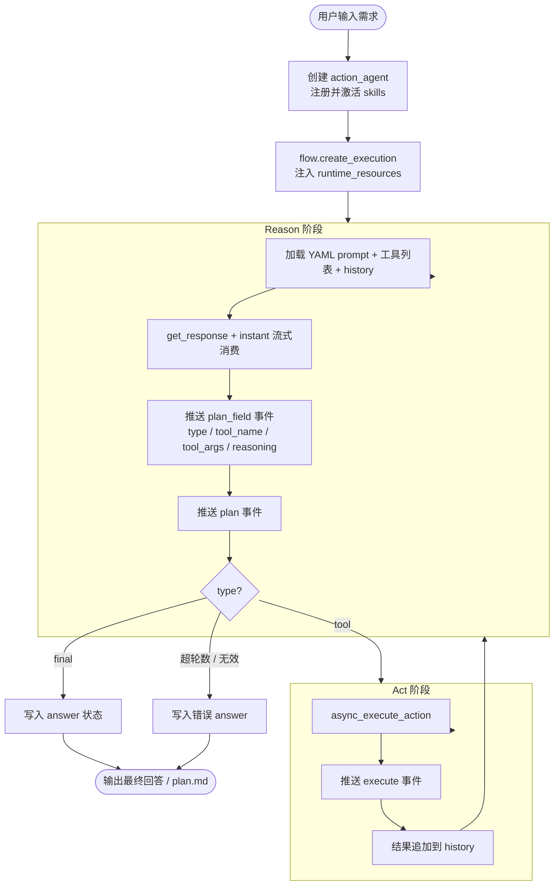
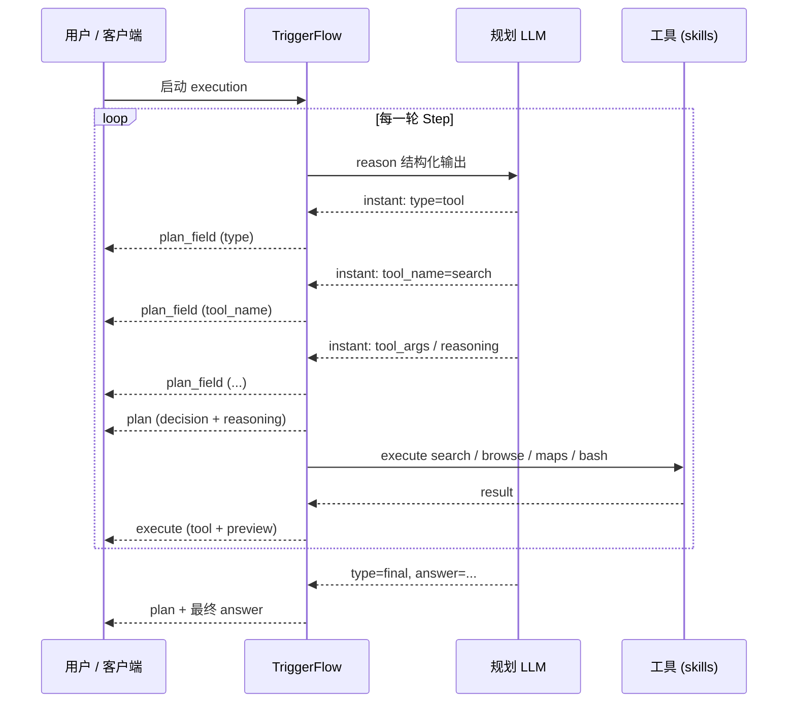

# Wayfinder — 可行动的智能行程寻路 Agent

> **Wayfinder**（寻路者）：不只给出文字建议，而是在搜索、阅读、地图与文档之间**主动找路**——帮你把「想去哪玩」变成可执行的行程。

基于 [Agently](https://github.com/AgentEra/agently) 构建的 **v5 旅游规划 Agent**：支持联网搜索、网页阅读、高德地图路线查询，以及 bash 写入行程文档。采用 **instant 字段级流式 + TriggerFlow 阶段级流式** 双层可观测架构，并提供 CLI 与 FastAPI 两种入口。

---

## 关于 Wayfinder

**Wayfinder** 这个名字想表达的核心是：**Agent 会在真实信息里为你寻路**。

| 维度 | 说明 |
|------|------|
| **寻** | 搜索攻略、浏览网页，从互联网抓取与需求相关的真实信息 |
| **路** | 调用高德 MCP 做地理编码、步行/驾车路线与距离估算 |
| **行** | 多轮 Reason → Act 循环，自动决定下一步调用工具还是输出最终方案 |
| **迹** | 可选通过 bash 将行程写入 `plan.md`，留下可复用的出行记录 |

与传统「一问一答」式聊天不同，Wayfinder 把 **Search、Browse、地图 MCP、bash sandbox** 串成一条可观测的执行链路——你在终端或 SSE 流里能实时看到 Agent 如何一步步找路、规划、落地。

---

## 功能概览

| 能力 | 说明 |
|------|------|
| 智能规划 | 根据用户需求多轮 Reason → Act，自动决定调用工具或输出最终行程 |
| 联网搜索 | Search 检索攻略与景点信息 |
| 网页阅读 | Browse 打开搜索结果中的详情页 |
| 地图服务 | 高德 MCP：地理编码、步行/驾车路线、距离与时间 |
| 文档产出 | bash sandbox 在工作目录写入 `plan.md`（需模型主动调用） |
| 流式观测 | instant 模式逐字段推送 `type` / `tool_name` / `tool_args` / `reasoning` |
| 服务化 | FastAPI 提供 JSON 与 SSE 流式接口 |

更详细的单次运行分析见 [`docs/北京一日游运行报告.md`](docs/北京一日游运行报告.md)。

---

## 技术栈

| 类别 | 技术 |
|------|------|
| Agent 框架 | **Agently 4.x**（TriggerFlow、ModelRequest、Action） |
| 大模型 | **DeepSeek**（OpenAI 兼容 API，可换 Ollama） |
| MCP | **高德地图 MCP**（`mcp.amap.com`） |
| Function Calling | Agently builtins：**Search**、**Browse** |
| 沙箱 | Agently **bash_sandbox**（白名单命令 + 工作目录隔离） |
| Web 服务 | **FastAPI** + **Uvicorn** |
| 配置 | **python-dotenv**、`.env` |
| Prompt | **YAML**（`load_yaml_prompt`） |
| 校验 / HTTP | **Pydantic**、**httpx** |

---

## 项目结构

```
wayfinder/                    # 项目根目录（Wayfinder）
├── client/                     # CLI 客户端
│   └── cli.py                  # 交互式 + 流式打印
├── test/                       # 验收脚本
│   └── verify_api.py           # FastAPI SSE 验收
├── requirements.txt
├── .env.example
├── config/                     # 配置模块
│   ├── settings.py             # 路径、环境变量、.env 加载
│   ├── agently.py              # 模型配置、make_agent()
│   └── service.py              # SERVICE_HOST / PORT / URL
├── skills/                     # 工具技能（可扩展）
│   ├── travel_skill_kit.py     # 旅游工具技能装配
│   ├── functionCalling/
│   │   └── web_actions.py      # Search / Browse
│   ├── mcp/
│   │   └── amap_maps.py        # 高德 MCP
│   └── bash/
│       └── sandbox.py          # bash sandbox
├── prompts/
│   └── travel_reason_decision.yaml  # Reason 阶段决策 prompt
├── agent_core/                 # 编排与服务
│   ├── main.py                 # FastAPI 入口
│   ├── flows/
│   │   └── travel_action_loop.py    # Reason / Act TriggerFlow
│   └── routers/
│       └── travel_api.py       # HTTP 路由
└── docs/
    └── 北京一日游运行报告.md
```

---

## 架构图



**分层职责：**

- **config**：环境与模型，不含业务逻辑
- **skills**：工具注册与激活，与编排解耦
- **agent_core/flows**：TriggerFlow 编排（Reason / Act 循环）
- **agent_core/routers**：HTTP 协议适配
- **prompts**：可独立修改的 YAML prompt

---

## 运行流程图

### 单次请求：Reason → Act 循环



### v5 双层流式



> **说明**：当前 demo 在 Reason 阶段会等 instant 字段流**全部消费完**再进入 Execute；字段可提前观测，但工具不会提前执行。

---

## 快速开始

### 1. 环境准备

```bash
cd d:\workspace\liding-agent   # 或你的 Wayfinder 项目路径
pip install -r requirements.txt
copy .env.example .env   # Windows
# 编辑 .env，填入 DEEPSEEK_API_KEY、AMAP_API_KEY
```

### 2. CLI 运行

```bash
python -m client 帮我规划北京一日游
# 或交互式
python -m client
```

终端将实时打印：

- `↳ field N.xxx` — instant 字段级流式
- `[Plan · Step N]` — 决策与推理摘要
- `[Execute]` — 工具执行结果预览

### 3. FastAPI 服务

```bash
python -m agent_core.main
# 默认 http://127.0.0.1:8000
```

| 方法 | 路径 | 说明 |
|------|------|------|
| GET | `/health` | 健康检查 |
| POST | `/v1/travel-agent` | 同步 JSON 响应 |
| POST | `/v1/travel-agent/stream` | SSE 流式事件 |

验收脚本（需先启动服务）：

```bash
python -m test.verify_api
```

---

## 环境变量

| 变量 | 说明 | 默认值 |
|------|------|--------|
| `DEEPSEEK_BASE_URL` | 模型 API 地址 | `https://api.deepseek.com` |
| `DEEPSEEK_DEFAULT_MODEL` | 模型名 | `deepseek-chat` |
| `DEEPSEEK_API_KEY` | API Key | — |
| `AMAP_API_KEY` | 高德 MCP Key | — |
| `SERVICE_HOST` | FastAPI 监听地址 | `127.0.0.1` |
| `SERVICE_PORT` | FastAPI 端口 | `8000` |
| `SERVICE_URL` | 验收脚本基址 | `http://127.0.0.1:8000` |

---

## 扩展指南

1. **新增工具**：在 `skills/` 下对应目录增加模块，并在 `skills/travel_skill_kit.py` 中注册与激活。
2. **调整 prompt**：编辑 `prompts/travel_reason_decision.yaml`，无需改 Python。
3. **更换模型**：修改 `.env` 或 `config/agently.py` 中的 OpenAI 兼容配置。

---

## License

示例工程，供学习与二次开发使用。
