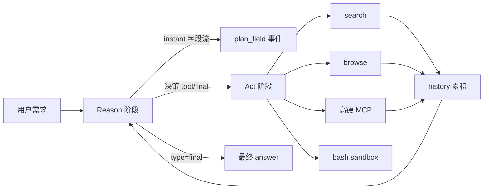

# 北京一日游 — Wayfinder 运行报告

> **Wayfinder**（寻路者）— 基于 `client/cli.py` 的一次完整执行记录（v5 · instant 模式 + 流式输出）  
> 用户需求：**请帮我规划北京一日游**

---

## 1. 启动与环境

| 项目 | 值 |
|------|-----|
| 运行模式 | CLI 交互式 |
| 工作目录 | `C:\Users\1\AppData\Local\Temp\travel_c_fb8ocw`（临时 sandbox） |
| 已激活工具 | **18** 个（高德 MCP 15 + search / browse / bash） |
| MCP 协议 | `2025-03-26`（高德地图 MCP 握手成功） |

Agent 进入 **Reason → Act** 循环，共执行 **11 轮** planning，其中前 10 轮为工具调用，第 11 轮输出最终回答。

---

## 2. 全链路时间线

两层流式叠加在本 run 中均可观测：

- **字段级（instant）**：`type` / `tool_name` / `tool_args` 往往先于 `reasoning` 出现
- **阶段级（TriggerFlow）**：`plan_field` → `plan` → `execute` 按步骤推送

### Step 1 — 搜索攻略

| 字段 | 值 |
|------|-----|
| 决策 | `tool` → `search` |
| 查询词 | `北京一日游最佳路线推荐 2025` |
| 结果 | 成功（后端实际走 **Yahoo** 搜索，返回多篇攻略标题） |

推理：先搜索经典路线与热门景点，建立信息基础。

### Step 2 — 浏览 KKday 攻略

| 字段 | 值 |
|------|-----|
| 决策 | `tool` → `browse` |
| URL | `https://www.kkday.com/zh-my/blog/18578/beijing-city-guide` |
| 结果 | **失败** — `Can not browse`（站点拒绝或无法抓取） |

### Step 3 — 浏览搜狐攻略

| 字段 | 值 |
|------|-----|
| 决策 | `tool` → `browse` |
| URL | `https://www.sohu.com/a/906896280_122248588` |
| 结果 | **失败** — 返回 `302 Found` 跳转页，未拿到正文 |

### Step 4 — 二次搜索（更具体关键词）

| 字段 | 值 |
|------|-----|
| 决策 | `tool` → `search` |
| 查询词 | `北京一日游经典路线 故宫 天安门 景山 南锣鼓巷 2025` |
| 结果 | 成功，命中「北京旅游必打卡线路」等结果 |

推理：browse 连续失败后，改用更精确的关键词补搜。

### Step 5 — 浏览知乎专栏

| 字段 | 值 |
|------|-----|
| 决策 | `tool` → `browse` |
| URL | `https://zhuanlan.zhihu.com/p/612818075` |
| 结果 | **失败** — 反爬/登录墙（返回占位 HTML，无有效正文） |

至此，**三次 browse 均未获得可用网页内容**，Agent 转而依赖搜索摘要 + 地图工具补全行程。

### Step 6–8 — 高德地理编码（maps_geo）

依次查询坐标：

| 地址 | 用途 |
|------|------|
| 天安门广场 | 行程起点 |
| 故宫博物院 | 核心景点 |
| 景山公园 | 经典动线终点（俯瞰故宫） |

三次调用均 **成功**，返回省市区及经纬度。

### Step 9–10 — 步行路线规划（maps_direction_walking）

| 路段 | 说明 |
|------|------|
| 天安门 → 故宫 | 步行约 3 公里量级（日志显示 route 成功） |
| 故宫 → 景山公园 | 短距离步行（route 成功） |

地图 MCP 在本 run 中 **稳定可用**，弥补了网页浏览失败带来的信息缺口。

### Step 11 — 最终回答（final）

| 字段 | 值 |
|------|-----|
| 决策 | `final` |
| 内容 | 输出完整 Markdown 行程（天安门 → 故宫 → 景山 → 南锣鼓巷 等） |

推理：搜索 + 地图坐标/步行距离已足够支撑一日游方案。

---

## 3. 运行结果摘要

### 成功的能力

- **instant 流式**：每步可提前看到 `type`、`tool_name`、`tool_args`，再看到 `reasoning`
- **搜索（search）**：2 次调用均返回结果，驱动后续决策
- **高德 MCP**：地理编码 3 次 + 步行规划 2 次，全部成功
- **多轮自愈**：browse 失败后自动换 URL、换关键词、改走地图，未陷入死循环

### 存在的问题

| 问题 | 现象 | 影响 |
|------|------|------|
| 搜索后端为 Yahoo | 日志出现 `search.yahoo.com` | 国内网络下可能慢或不稳定；与「仅用百度」预期不符 |
| browse 反爬 | KKday / 搜狐 / 知乎均无法读正文 | 无法深度消化攻略细节，行程偏「搜索标题 + 地图」组合 |
| **plan.md 未落盘** | `plan.md 存在：False` | 模型在 `answer` 里写了 Markdown，但 **未调用 bash** 写入工作目录 |

最后一点与 system prompt 要求「把行程写成 markdown 文件」不一致，属于 **工具调用遗漏**，而非流式或编排 bug。

---

## 4. 架构视角：数据如何流动

本 run 中 **Search / Map 走通闭环**，**Browse / Bash 未贡献有效产出**。

---

## 5. v5 特性在本 run 中的体现

1. **字段级流式**：例如 Step 1 先出现 `type=tool`、`tool_name=search`，随后才是完整 `reasoning`
2. **阶段级流式**：每个 Step 结束有 `[Plan · Step N]`，工具执行后有 `[Execute]`
3. **Execute 仍等字段流结束**：即使提前看到 `tool_name=search`，也要等 `reasoning` 等字段收齐才进入 Act
4. **全链路可观测**：11 步决策与 10 次工具执行均在终端可见，便于调试与演示

---

## 6. 改进建议（供后续迭代）

1. **搜索限定百度**：在 `skills/function_calling.py` 中替换或封装 Search，避免默认 fallback 到 Yahoo
2. **强化 browse 失败策略**：prompt 中增加「browse 失败两次后优先用 search 摘要 + 地图，勿反复 browse 同类型站点」
3. **强制写文件**：在 `final` 前增加检查，或 instruct 明确要求「回答前必须 bash 写入 `plan.md`」
4. **缩短 MCP 握手日志**：生产环境可调低 agently 日志级别，减少 `Negotiated protocol version` 重复输出

---

## 7. 结论

本次运行展示了 **Wayfinder** v5 **从搜索 → 浏览（部分失败）→ 地图补全 → 生成行程** 的完整闭环。  
**流式观测与多轮工具调度工作正常**；主要短板在于 **境外搜索后端**、**中文站点 browse 成功率** 以及 **未执行 bash 写 plan.md**。  
若三者补齐，同一套 TriggerFlow + skills 架构即可稳定产出可执行的本地 Markdown 行程文件。
